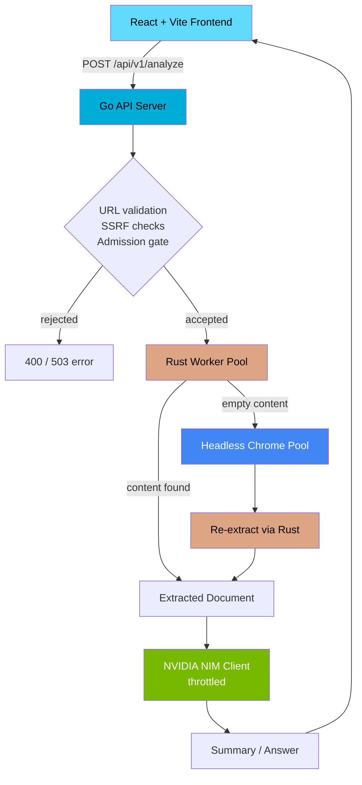

# URL Extraction & Summarization Engine

**Fetch any webpage, extract the real content, and get an AI summary — powered by a Go + Rust concurrency pipeline.**


> 📸 *Screenshot/GIF of the UI goes here — paste one URL, click Analyze, get a summary.*

---

## What is this?

A backend systems-engineering demo: paste a URL, and it fetches the page, extracts the real content (stripping ads/nav/boilerplate), and uses an LLM (NVIDIA NIM) to summarize it or answer a question about it — all running locally, built to showcase concurrent process architecture, not to be a hosted product.

**Key features:**
- 🦀 **Rust extraction engine** — fast, safe HTML parsing with SSRF-hardened fetching
- 🐹 **Go orchestration layer** — a pooled worker architecture instead of naive spawn-per-request
- 🌐 **JS-page support** — falls back to a pooled headless Chrome instance for JS-rendered pages
- 🤖 **NVIDIA NIM integration** — summarize a page, or ask it a direct question
- ⚛️ **React + Vite frontend** — minimal UI to drive the whole pipeline

---

## Table of Contents

- [Getting Started](#getting-started)
- [Usage](#usage)
- [Architecture](#architecture)
- [Performance](#performance)
- [Known Limitations](#known-limitations)
- [Contributing](#contributing)
- [License & Credits](#license--credits)

---

## Getting Started

**Requirements:**
- Go 1.22+
- Rust (stable, via `rustup`)
- Node.js 18+
- An NVIDIA NIM API key ([build.nvidia.com](https://build.nvidia.com))

**Install & build:**
```bash
git clone https://github.com/yourname/url-extraction-engine.git
cd url-extraction-engine/web-intelligence

# Build the Rust extractor
cd extractor && cargo build --release
cp target/release/extractor ../backend/bin/extractor   # Windows: extractor.exe

# Set up the backend
cd ../backend
export NVIDIA_NIM_API_KEY=your_key_here
go get github.com/chromedp/chromedp
go run ./cmd/server

# Set up the frontend (new terminal)
cd ../frontend
npm install
npm run dev
```

Open `http://localhost:5173`.

---

## Usage

**Via the UI:** paste a URL, hit Analyze.

**Via the API directly:**
```bash
curl -X POST http://localhost:8080/api/v1/analyze \
  -H "Content-Type: application/json" \
  -d '{"url": "https://example.com/article"}'
```

With a question:
```bash
curl -X POST http://localhost:8080/api/v1/analyze \
  -H "Content-Type: application/json" \
  -d '{"url": "https://example.com/article", "question": "What is the main argument?"}'
```

**Response:**
```json
{
  "status": "success",
  "result": { "title": "...", "nim_answer": "..." },
  "meta": { "request_id": "...", "total_duration_ms": 1234 }
}
```

---

## Architecture



Go and Rust communicate over a hand-rolled line-delimited JSON protocol across OS pipes, using a pool of long-lived worker processes rather than spawning one per request. Full design rationale is in the project's architecture notes (available on request).

---

## Performance

Benchmarks were run locally on **2026-09-11**. Results are intended to characterize the current local configuration, not production capacity.

### End-to-end API

Load test:

- **5 VUs**
- **90-second test**
- **90-second per-request timeout**
- `POST /api/v1/analyze`

| Metric | Result |
|---|---:|
| Requests completed | 8 |
| Throughput | **0.0667 req/s** |
| Average latency | **52.2s** |
| p50 | **52.15s** |
| p95 | **74s** |
| Maximum latency | **75s** |
| Failure rate | **62.5%** |

The end-to-end result is dominated by the external NVIDIA NIM dependency under concurrent load.

### Rust extraction

#### Real-world fetch + extraction

Seven successful real-world URL requests were sampled through the API:

| Metric | Result |
|---|---:|
| Samples | 7 |
| Average | **1.94s** |
| p50 | **2.08s** |
| Minimum | **0.99s** |
| Maximum | **3.21s** |

These timings include the Rust-side URL fetch and extraction path. They are real-world samples rather than synthetic microbenchmarks.

#### Criterion extraction benchmark

`cargo bench` on the Rust extractor produced:

| Benchmark | Result |
|---|---:|
| Small page (758 B) | **11.832 µs** |
| Large page (194 KB) | **2.5432 ms** |
| Subprocess startup | **8.8875 ms** |

The Criterion benchmark measures local extraction/process overhead and does **not** represent Internet fetch latency.

### Resource usage

During the observed k6 load test, the Go server's Windows working set remained around **21–22 MB**. The captured PowerShell `CPU` value was cumulative CPU time rather than CPU utilization percentage, so no CPU-% claim is made here.

---

## Known Limitations

- **NVIDIA NIM is the dominant external bottleneck.** Observed inference latency was commonly around 20–30+ seconds, with some requests taking substantially longer.
- Under concurrent load, NVIDIA NIM returned `503 Service temporarily overloaded`. Increasing NIM concurrency from 1 to 2 did not provide scalable throughput and increased upstream overload symptoms.
- The current synchronous request path has a **75-second end-to-end deadline**. Slow or overloaded NIM calls can therefore cause otherwise healthy requests to time out.
- The Go NIM HTTP client also has a **60-second client timeout**, which can terminate a request before the 75-second application deadline if NIM has not returned HTTP headers.
- Sites with aggressive bot protection (Cloudflare-style challenges) may return `403` and fail — advanced anti-bot bypass is intentionally out of scope.
- Very slow pages time out after 20s (by design).
- Pool sizes are reasonable local defaults; the benchmark above does not establish production-scale capacity.
- No persistence, no auth, no hosting — this runs locally only.

---

## Contributing

This is a personal learning project and not currently accepting external contributions, but issues/suggestions are welcome.

---

## License & Credits

MIT License. Built with [reqwest](https://github.com/seanmonstar/reqwest), [scraper](https://github.com/causal-agent/scraper), [chromedp](https://github.com/chromedp/chromedp), and the [NVIDIA NIM](https://build.nvidia.com) API.
